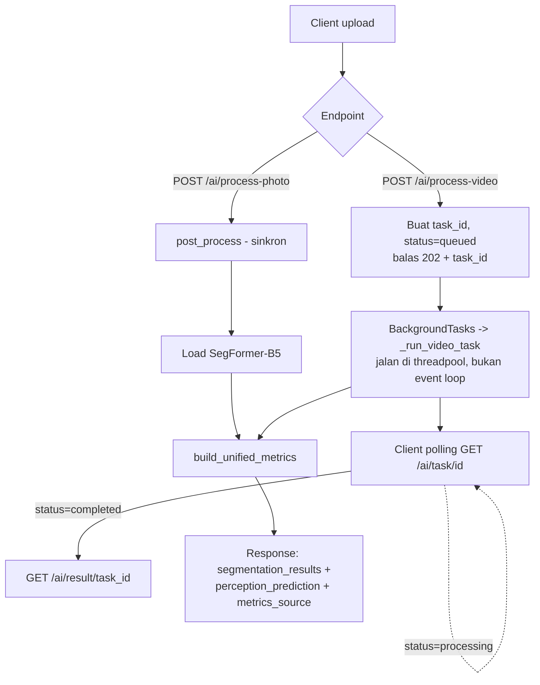
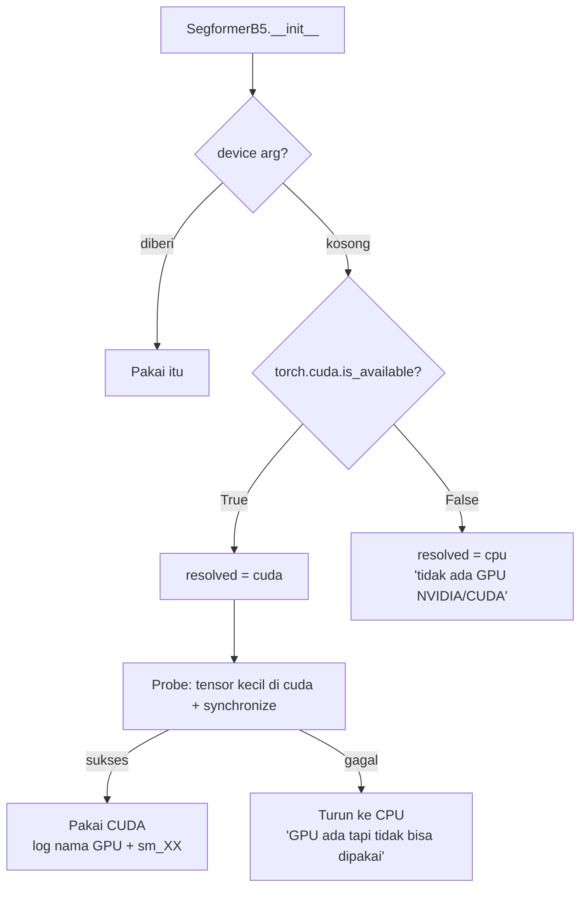
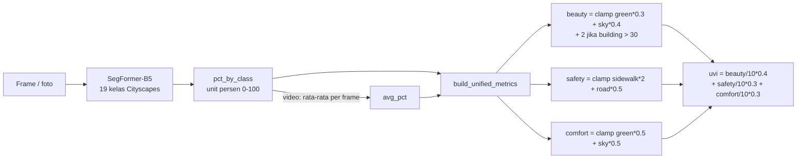

# Alur Pipeline UVIP-AI

Dokumen ini menjelaskan alur nyata di kode (`src/uvip_ai/api/main.py`), termasuk
titik-titik yang dulu bikin video gagal di server.

---

## 1. Alur Request (foto & video)



Catatan penting:
- `_run_video_task` **sync**, bukan `async`. Starlette menjalankannya di
  threadpool supaya infer PyTorch (blocking) tidak membekukan event loop.
  Kalau dijadikan `async` lagi, status/result bisa balas 404/202 palsu.
- Model di-cache lewat `get_seg_model()` (load sekali, reuse semua task).

---

## 2. Alur Video (perbaikan H.264 + anti-EAGAIN)

```mermaid
flowchart TD
    A[Video upload] --> B[Load model + VideoProcessor]
    B --> C[Cek sisa disk<br/>butuh ~400KB/frame + 200MB]
    C -->|disk kurang| X1[Gagal cepat<br/>pesan jelas]
    C -->|cukup| D[Loop frame]

    D --> E[infer -> seg_map + pct_by_class]
    E --> F[create_overlay]
    F --> G[Tulis JPG ke disk<br/>f_{i:06d}.jpg]
    G --> D

    D --> H[_encode_h264_frames]
    H --> I{Pass 1: default threads}
    I -->|gagal EAGAIN| J{Pass 2: -threads N -filter_threads 1}
    I -->|sukses| K[Verifikasi codec = H.264]
    J --> K
    K -->|bukan H.264| X2[Tolak - 'sukses palsu']
    K -->|H.264| L[Verifikasi playable<br/>_verify_playable]
    L --> M[Hapus folder frame]
    M --> N[Aggregate pct_by_class rata-rata]
    N --> O[build_unified_metrics]
```

### Kenapa frame ditulis ke disk satu per satu

Dulu semua overlay ditahan di list `output_frames` lalu ditulis setelah loop.
Untuk 408 frame 1080p itu ~2.5 GB per salinan (x2 dengan frame asli) di RAM.
Server kecil (Vast.ai, RAM ~9 GB) kehabisan memori, dan `pthread_create`
gagal -> ffmpeg melaporkan:

```
[Parsed_scale_2] Failed to configure output pad on Parsed_scale_2
Error reinitializing filters! Resource temporarily unavailable
Error while opening encoder - maybe incorrect parameters ...
```

Kunci diagnosis: **`filter=none` pun gagal**. Kalau filter yang salah, `none`
seharusnya jalan. Karena semuanya gagal, akarnya bukan filter tapi
**pembuatan thread gagal (EAGAIN)**.

### Tiga lapis penanganan

| Lapis | Apa | Di mana |
|---|---|---|
| 1 | Frame ditulis streaming ke disk, tidak ditahan di RAM | `_run_video_task` |
| 2 | Thread dibatasi sesuai RAM (`_resolve_encoder_threads`, ~40 MB/thread, maks 4) | pass 2 di `_encode_h264_frames` |
| 3 | Cek disk sebelum mulai, pesan error berisi detail | `_run_video_task`, `_run_ffmpeg` |

`_ffmpeg_version` + ringkasan stderr head+tail: penyebab asli libx264 ada di
**awal** output, jadi tidak boleh cuma ambil ekor (`err[-400:]`) - itu yang bikin
kegagalan lama cuma tampil "Generic error in an external library".

---

## 3. Pemilihan Device (fleksibel GTX / RTX / CPU)



Tidak ada pengecekan merek. Semua GPU NVIDIA lewat jalur yang sama:
GTX 10-series (Pascal `sm_61`), RTX 20/30/40 (Turing/Ampere/Ada), Tesla, dsb.
Yang membedakan hanya **build torch** harus punya kernel untuk `sm_XX` kartu
tersebut. Kalau tidak, probe gagal dan sistem otomatis jalan di CPU - tidak
crash. Cek hasil nyata di `GET /health`:

```json
{"gpu": "NVIDIA GeForce RTX 3060 Laptop GPU", "gpu_capability": "sm_86",
 "device_resolved": "cuda", "fp16": true,
 "ram_available_gb": 5.9, "encoder_threads": 4}
```

---

## 4. Dari Persentase ke Skor (rumus existing)



- `clamp` = `min(10, max(0, x))` -> skor 0-10.
- `green_pct` = `vegetation + tree`, `building_pct` = `building`.
- `uvi_score` rentangnya **0-1**, bukan 0-10.
- Video: `avg_pct[k] = sum(p[k] for p in frame_pcts) / n`.

---

## 5. Titik Diagnosa

| Endpoint | Untuk apa |
|---|---|
| `GET /health` | Build stamp, GPU/CPU, RAM, sisa disk, batas thread, hasil self-test |
| `GET /health/ffmpeg` | Binary mana yang benar-benar bisa encode H.264, lewat filter apa |
| `GET /ai/task/{id}` | Progres: `phase`, `frames_processed`, `total_frames` |
| `GET /ai/result/{id}` | Hasil akhir + `video_codec` + `video_playable_in_browser` |

Kalau encode gagal, folder frame JPG **tidak dihapus** supaya bisa diperiksa,
dan pesan error memuat detail ffmpeg yang gagal.
